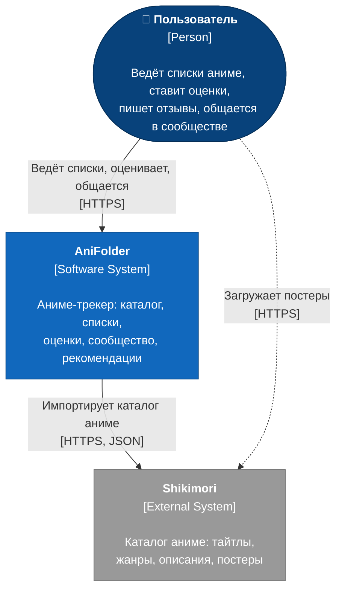
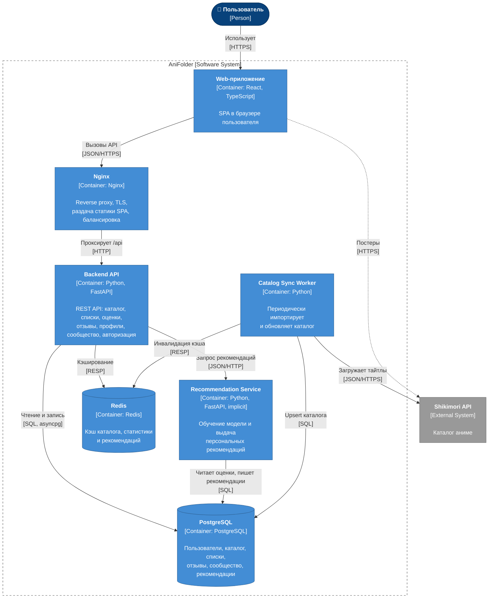
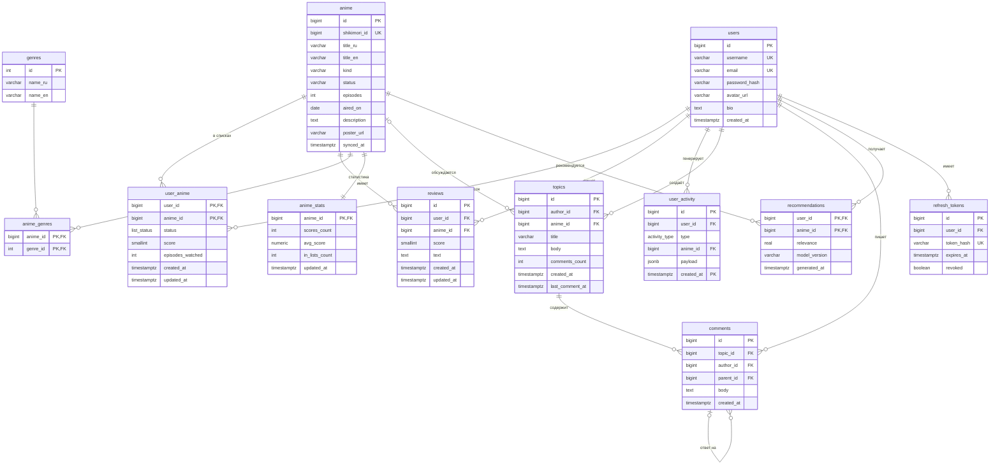
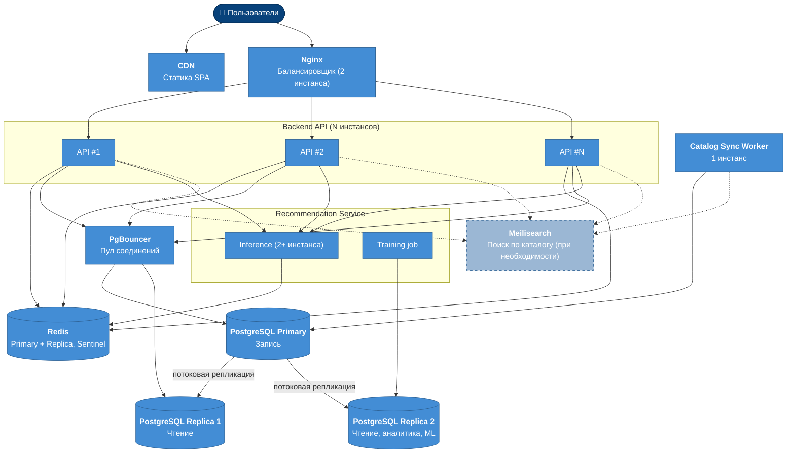

# Anifolder

## Участники проекта

- Киселев Сергей 5130904/40105 — ML-engineer
- Хорошилов Федор 5130904/40105 — Teamlead , Devops
- Бревнов Никита 5130904/40105 — Backend-developer
- Мезенцев Антон 5130904/40105 - Frontend-developer

## Проблема

Много молодёжи, да и не только молодёжь интересуются в нашей стране интересуются аниме и им хотелось отслеживать то,что они просмотрели или сделать рецензию на тот или иной тайтл.В основном они пользовались сайтом MyAnimeList.com , но в последние время этот сайт Российским пользователям перестал быть доступным.

## Требования

- Когда я закончил смотреть тайтл, я хочу поставить оценку и оставить отзыв, чтобы поделиться мнением с сообществом и сохранить историю просмотров.
- Когда я не знаю, что посмотреть дальше, я хочу получить персональные рекомендации на основе моих прошлых оценок.
- Когда я смотрю профиль другого пользователя, я хочу видеть его оценки и списки, чтобы понять, похож ли его вкус на мой.

## Разработка архитектуры и детальное проектирование

### Исходные данные

| Параметр | Значение |
|---|---|
| Активных пользователей в сутки | 20 000 |
| Зарегистрированных пользователей | ~100 000 на старте, +30 000 в год, ~400 000 через 10 лет |
| Срок хранения данных | 10 лет |
| Источник каталога аниме | [Shikimori API](https://shikimori.one/api/doc) |

### Характер нагрузки

#### Профиль активного пользователя за сутки

| Действие | Тип | Запросов на пользователя в сутки |
|---|---|---|
| Каталог: поиск, фильтры, карточки тайтлов | R | 15 |
| Свои и чужие списки, профили, активность | R | 10 |
| Чтение сообщества (темы, комментарии) | R | 10 |
| Отзывы на странице тайтла | R | 3 |
| Рекомендации | R | 2 |
| Добавление в список, смена статуса и прогресса | W | 2 |
| Оценка тайтла | W | 1 |
| Сообщение в сообществе | W | 1 |
| Отзыв | W | 0.1 |
| **Итого** | | **R: 40, W: 4.1** |

#### Соотношение R/W и RPS

- Чтений в сутки: 20 000 × 40 = **800 000**; записей: 20 000 × 4.1 = **82 000**.
- Соотношение **R/W ≈ 10 : 1**: нагрузка преимущественно на чтение, это определяет ставку на кэш и read-реплики.
- Средняя нагрузка: 882 000 / 86 400 ≈ **10 RPS**.
- Пиковая нагрузка (вечерние часы, коэффициент 5): **~50 RPS**, из них ~46 RPS чтение и ~5 RPS запись.

#### Объёмы трафика

| Тип трафика | Расчёт | В сутки |
|---|---|---|
| Ответы API | 800 000 чтений × 8 КБ (средний JSON) | ~6.4 ГБ |
| Запросы API | 882 000 × ~0.5 КБ (заголовки и тела записей) | ~0.5 ГБ |
| Статика SPA | 20 000 × 1.5 МБ × 30% (холодный кэш браузера) | ~9 ГБ |
| **Итого исходящий** | | **~16 ГБ/сутки, ~0.5 ТБ/месяц** |

#### Объёмы дисковой системы

| Таблица | Прирост в сутки | Размер строки | За год | За 10 лет |
|---|---|---|---|---|
| `users` | ~80 | 1 КБ | 30 МБ | ~0.4 ГБ |
| `anime`, `genres`, `anime_genres` | ~3 | 5 КБ | 5 МБ | ~0.2 ГБ |
| `user_anime` (списки и оценки) | 20 000 | 200 Б | 1.5 ГБ | ~15 ГБ |
| `reviews` | 2 000 | 2.5 КБ | 1.8 ГБ | ~18 ГБ |
| `topics`, `comments` | 20 000 | 700 Б | 5.1 ГБ | ~51 ГБ |
| `user_activity` | 62 000 | 200 Б | 4.5 ГБ | ~45 ГБ |
| `recommendations` | перезаписывается | 50 Б × 50 на пользователя | ~1 ГБ | ~1 ГБ |
| **Итого** | **~35 МБ** | | **~13 ГБ** | **~130 ГБ** |

- С запасом: **~200 ГБ на узел PostgreSQL**. Read-реплика занимает столько же.
- Redis: горячие карточки тайтлов (~150 МБ) и рекомендации активных пользователей (~40 МБ), итого **меньше 1 ГБ RAM**.

### C4: Уровень 1. Диаграмма контекста



### C4: Уровень 2. Диаграмма контейнеров



**Назначение контейнеров:**

- **Backend API** не хранит состояние: авторизация через JWT, поэтому его можно масштабировать горизонтально.
- **Catalog Sync Worker** один раз выполняет полный импорт каталога. Дальше раз в сутки он обновляет онгоинги, анонсы и новые тайтлы. Пользовательские запросы никогда не ходят в Shikimori синхронно, поэтому лимиты и недоступность Shikimori на сайт не влияют.
- **Recommendation Service** раз в сутки обучает модель коллаборативной фильтрации (ALS на матрице «пользователь × тайтл» из оценок и статусов). Для пользователей, активных за последние 30 дней, он заранее рассчитывает топ-50 тайтлов. Новым пользователям без оценок отдаются популярные тайтлы из любимых жанров (холодный старт).

### Контракты API

REST, JSON, префикс `/api/v1`. Авторизация: `Authorization: Bearer <JWT>`, access-токен живёт 15 минут, refresh-токен 30 дней. Полная спецификация OpenAPI генерируется FastAPI и доступна по `/docs`.

Формат ошибки:

```json
{ "error": { "code": "ANIME_NOT_FOUND", "message": "Аниме с id=123 не найдено" } }
```

Каталог использует постраничную пагинацию (`page`, `limit`). Ленты активности и сообщества используют пагинацию по курсору (`cursor`, `limit`).

#### Список эндпоинтов

| Метод | Путь | Авторизация | Описание | p95 |
|---|---|---|---|---|
| POST | `/auth/register` | — | Регистрация | 500 мс |
| POST | `/auth/login` | — | Вход, выдача токенов | 500 мс |
| POST | `/auth/refresh` | — | Обновление access-токена | 200 мс |
| GET | `/anime` | — | Поиск и фильтрация каталога | 300 мс |
| GET | `/anime/{id}` | — | Карточка тайтла со статистикой | 150 мс |
| GET | `/anime/{id}/reviews` | — | Отзывы на тайтл | 200 мс |
| POST | `/anime/{id}/reviews` | ✓ | Написать отзыв | 500 мс |
| PATCH / DELETE | `/reviews/{id}` | ✓ (автор) | Изменить или удалить отзыв | 300 мс |
| GET | `/genres` | — | Список жанров | 100 мс |
| PUT | `/me/list/{anime_id}` | ✓ | Добавить в список или изменить статус, оценку, прогресс | 300 мс |
| DELETE | `/me/list/{anime_id}` | ✓ | Убрать из списка | 300 мс |
| GET | `/me/recommendations` | ✓ | Персональные рекомендации | 300 мс |
| GET | `/users/{username}` | — | Профиль и статистика | 200 мс |
| GET | `/users/{username}/list` | — | Список пользователя по статусам | 200 мс |
| GET | `/users/{username}/activity` | — | Лента активности | 200 мс |
| GET | `/users/{username}/compatibility` | ✓ | Совпадение вкусов с текущим пользователем | 300 мс |
| GET | `/topics` | — | Темы сообщества (общие или по тайтлу) | 200 мс |
| POST | `/topics` | ✓ | Создать тему | 500 мс |
| GET | `/topics/{id}/comments` | — | Комментарии темы | 200 мс |
| POST | `/topics/{id}/comments` | ✓ | Написать комментарий | 500 мс |

Внутренний API Recommendation Service (снаружи недоступен):

| Метод | Путь | Описание |
|---|---|---|
| GET | `/internal/v1/recommendations/{user_id}?limit=20` | Рекомендации для пользователя |
| POST | `/internal/v1/train` | Запуск переобучения (вызывается по расписанию) |

#### Нефункциональные требования

| Требование | Значение |
|---|---|
| Время отклика на чтение | p95 ≤ 200 мс, p99 ≤ 500 мс |
| Время отклика на поиск по каталогу и рекомендации | p95 ≤ 300 мс |
| Время отклика на запись | p95 ≤ 500 мс |
| Пиковая нагрузка | 50 RPS без деградации, запас до 150 RPS |
| Доступность | 99.5% (≤ 3.6 ч простоя в месяц) |
| Актуальность каталога | обновление не реже 1 раза в сутки |
| Актуальность рекомендаций | переобучение не реже 1 раза в сутки |
| Недоступность Shikimori | не влияет на работу сайта (каталог хранится локально) |

### Схема базы данных



**Ключевые индексы и ограничения:**

| Таблица | Индекс или ограничение | Для какого запроса |
|---|---|---|
| `anime` | GIN (`pg_trgm`) по `title_ru`, `title_en` | Нечёткий поиск по названию |
| `anime` | B-tree по `(kind, aired_on)`, `anime_genres(genre_id)` | Фильтры каталога |
| `user_anime` | PK `(user_id, anime_id)` | Список пользователя, upsert |
| `user_anime` | `(user_id, status, updated_at DESC)` | Вкладки списка по статусам |
| `user_anime` | `(anime_id)` | Пересчёт статистики тайтла, выгрузка для ML |
| `reviews` | UNIQUE `(user_id, anime_id)`, `(anime_id, created_at DESC)` | Один отзыв на тайтл, лента отзывов |
| `user_activity` | `(user_id, created_at DESC)`, партиционирование по месяцам | Лента активности профиля |
| `topics` | `(last_comment_at DESC)`, `(anime_id, last_comment_at DESC)` | Список тем |
| `comments` | `(topic_id, created_at)`, партиционирование по годам | Комментарии темы |
| `user_anime.score`, `reviews.score` | CHECK `score BETWEEN 1 AND 10` | Валидация оценки |

#### Почему схема выдержит нагрузку

1. **Все частые запросы идут по индексу.** Чтение списка, профиля, отзывов, комментариев и ленты активности сводится к range scan по составному индексу с `LIMIT`. Время таких запросов исчисляется единицами миллисекунд и не зависит от общего объёма таблицы.
2. **Нагрузка небольшая для PostgreSQL.** Пик в ~50 RPS даёт порядка 100–150 простых SQL-запросов в секунду. Один узел PostgreSQL на 4 vCPU обрабатывает тысячи таких запросов в секунду, так что запас больше чем в 10 раз.
3. **Горячие чтения уходят в Redis.** Карточки тайтлов, результаты популярных поисков, `anime_stats` и рекомендации кэшируются с TTL от 5 минут до 24 часов. Ожидаемый hit rate по каталогу выше 80%, поэтому до БД доходит малая часть чтений.
4. **Агрегаты считаются заранее.** Средняя оценка и число оценок хранятся в `anime_stats` и пересчитываются фоновой задачей раз в 10 минут, а не через `AVG()` на каждый запрос. Рекомендации ML-сервис рассчитывает заранее и кладёт в `recommendations`, поэтому выдача сводится к чтению по PK.
5. **Запись дешёвая.** ~5 записей/с в пике идут точечными INSERT и UPSERT по PK без долгих блокировок. Счётчики тайтлов не обновляются в транзакции пользователя, поэтому на популярных тайтлах не возникает горячих строк.
6. **Объём помещается на один узел.** ~130 ГБ за 10 лет — нормальный размер для одного инстанса PostgreSQL.
7. **Большие таблицы, растущие только на добавление, партиционированы.** `user_activity` и `comments` разбиты по времени, поэтому индексы свежих партиций остаются маленькими и горячими. Данные хранятся 10 лет, но старые партиции почти не читаются и не мешают VACUUM.
8. **Обучение ML не нагружает основную БД.** Выгрузка матрицы оценок для обучения идёт с read-реплики.

### Масштабирование при росте нагрузки в 10 раз

Целевые параметры: **200 000 DAU, ~500 RPS в пике (~50 RPS запись), ~1.3 ТБ данных за 10 лет, ~160 ГБ трафика в сутки.**



| Компонент | Сейчас (×1) | При росте ×10 | Обоснование |
|---|---|---|---|
| Backend API | 1–2 инстанса | 4–6 инстансов за Nginx | Сервис не хранит состояние (JWT), масштабируется линейно |
| Nginx | 1 | 2 (active/standby) | Отказоустойчивость точки входа |
| Статика SPA | Nginx | CDN | Снимает ~90 ГБ/сутки трафика с серверов |
| PostgreSQL | 1 primary + 1 replica | 1 primary + 2 replica, PgBouncer | Чтения (90%) идут на реплики; ~50 записей/с primary выдерживает |
| Диски PostgreSQL | ~200 ГБ | ~500 ГБ на узел, расширение по мере роста | Прирост ~130 ГБ/год: диск берётся с запасом на 2 года и расширяется онлайн, не нужно резервировать 1.3 ТБ на все 10 лет сразу. Старые партиции `user_activity` и `comments` можно вынести на дешёвый HDD-tablespace |
| Redis | 1 инстанс, < 1 ГБ | Primary + replica + Sentinel, ~4 ГБ | Hit rate кэша критичен для разгрузки БД |
| Поиск | `pg_trgm` | Meilisearch, если p95 поиска > 300 мс | Выносит полнотекстовый поиск из PostgreSQL |
| Recommendation Service | 1 инстанс | 2+ инстанса inference; обучение отдельной задачей на реплике | Выдача — это чтение готовых данных, она масштабируется горизонтально |
| Catalog Sync Worker | 1 | 1 | Объём каталога не зависит от числа пользователей, лимит Shikimori общий |
